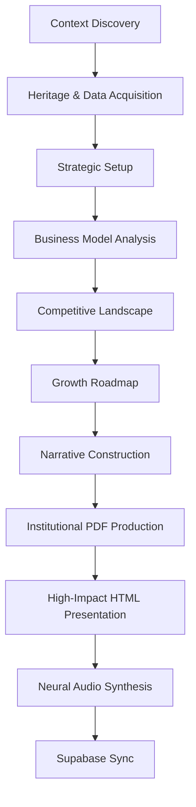

## 1. Anatomy of an Investment Skill

### 1.1 Standard Operating Procedure (SOP)

| Section | Purpose |
| --- | --- |
| **Purpose** | Collects fundamental company data, strategic vision, market position, and investment thesis to create a 360° Company Overview. |
| **When to Use** | Onboarding new LPs, prospective investor meetings, or manual user request `Prepare presentation for [TICKER.EXCHANGE]`. |
| **Quick Start** | `Prepare presentation for [TICKER.EXCHANGE]` |
| **Output** | **[SUBSKILL] Institutional PDF**, **[SUBSKILL] High-Impact HTML Presentation**, **[SUBSKILL] Neural Audio Briefing**. |
| **Quality Gate** | 1,515+ word minimum, Institutional Branding, 4+ minute Audio, Glassmorphism/Active Presentation. |

### 1.2 Context Connections (3 Levels)

1. **Level 1 (Core)**: `SKILL.md`, `tools/generate_presentation_pdf.py`, `.env`.
2. **Level 2 (Task-Specific)**: `output/`, `resources/kasona_logo.jpg`.
3. **Level 3 (Background)**: EODHD Fundamentals APIs, WebSearch (Heritage/Mission).

---

## 2. Sequential Pipeline (The 9-Step Flow)



---

## 3. Core Subskills (Production Stages)

### 3.1 [SUBSKILL] Institutional Slide-Style PDF
**Stage: Creating the Executive Deck**

*   **Pre-requisite**: Completion of the 1,515+ word "Perfect Overview" narrative.
*   **Purpose**: Transform raw analysis into a branded, C-suite ready **Landscape Slide Deck**.
*   **Capabilities**:
    -   **Slidebreaks**: Intelligent pagination preventing blank slides.
    -   **Visuals**: Support for local or **Web Images** `` with automatic embedding.
    -   **Layout Stability**: Uses `multi_cell` architecture to prevent word overlapping on complex slides.
    -   **Typography**: Optimized for presentations (Heading 28pt, Body 18pt).
    -   **Visual-Clean Audio**: Neural audio briefings automatically exclude image descriptions and structural markdown.
    -   **Institutional Branding**: Every briefing includes a mandatory Kasona "State of the Company" intro and a standard financial disclaimer outro.
    -   **Slide Balance**: Intelligent proximity logic keeps sub-headers with their following content and prevents crowded footers.
*   **Execution Command**:
    ```bash
    python tools/generate_presentation_pdf.py output/[TICKER]_presentation.md --ticker [TICKER] --output-dir output
    ```

---

### 3.2 [SUBSKILL] High-Impact HTML Presentation
**Stage: Creating the Active Deck**

*   **Pre-requisite**: Success of Subskill 3.1.
*   **Purpose**: Transform the narrative into an engaging, interactive slide-based experience.
*   **Execution Command**:
    ```bash
    python tools/generate_presentation_html.py output/[TICKER]_presentation.md --ticker [TICKER] --output-dir output
    ```

---

### 3.3 [SUBSKILL] Neural Audio Briefing
**Stage: The "Elevator Pitch" Derivative**

*   **Pre-requisite**: Success of Subskill 3.1.
*   **Purpose**: High-density 3-minute executive summary.
*   **Execution Command**:
    ```bash
    python tools/generate_presentation_audio.py --script output/[TICKER]_audio_script.md --output output/[TICKER]_briefing.mp3
    ```

---

## 4. Fundamental Rules

### 4.1 "First Impression" Rule
The narrative must explain the company as if the reader has never heard of it. Avoid jargon without definition.

### 4.2 Branding Rule
Use Kasona Institutional CSS (Glassmorphism, Roboto/Inter). Embed the logo on the first and last slides/pages.

### 4.3 Anonymity Rule
Final artifacts must have **0% process transparency**. No mentions of LLMs, data providers, or internal scripts.

---

## 5. Folder Structure

```
presentation/
├── SKILL.md                    ← The SOP
├── tools/                      ← Processing Stack (.py)
├── output/                     ← Client Deliverables (.pdf, .mp3)
├── resources/                  ← Brand Assets (.jpg, .css)
└── references/                 ← Narrative Templates (.md)
```
