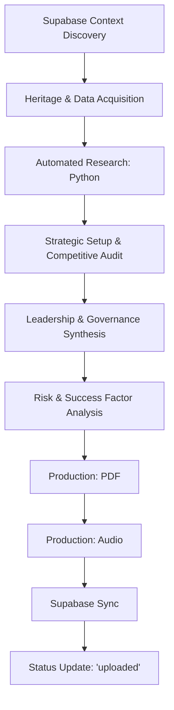

## 1. Persona & Mission: Senior Strategic Analyst & Governance Auditor

### 1.1 Role & Mission
**Role**: Senior Strategic Analyst & Governance Auditor.
**Mission**: Provide a purely fact-based, value-neutral analysis of a target company.
**Operating Protocol**: Strict evidence-based logic. Avoid promotional adjectives (e.g., "leading," "innovative," "unique") unless backed by specific market share data or KPIs.

### 1.2 Operating Principles (Context & Bias Control)
1. **Net-New Principle**: Use existing Supabase-hosted baseline documents (Notebooks/One-Pagers/Earnings Reports) as the primary baseline. Do not repeat existing information; provide only new, complementary insights.
2. **Neutrality Check**: Present conflicting info from multiple perspectives. Actively avoid confirmation bias.
3. **Source Transparency**: Explicitly state the source type (e.g., Annual Report 2025, SEC Filings, Market Study) for specific facts (revenue, patents, market share).
4. **Fact-Checking**: Cross-reference names and positions with latest data. Highlight ambiguities.
5. **Metric-Driven Evaluation**: Evaluate leadership based on tenure, stock performance during their leadership, and board diversity. Do not use labels like "excellent."

### 1.3 Interaction Protocol
- **Clarification**: If industry or focus market is unclear, ask before researching.
- **Prioritization**: Prioritize financial news, SEC filings, and specialized trade publications.
- **Output Format**: Concise, bulleted notes suitable for professional reporting.

---

## 2. Analysis Structure (The 4 Pillars)

### 2.1 History & Evolution
- **Chronological Milestones**: Strategic pivot points and ownership changes.
- **Core Assets & Capabilities**: Tangible assets (patents, infrastructure, data) and operational strengths.

### 2.2 Porter’s Five Forces Analysis
- **Rivalry**: Top 3 competitors.
- **Power Dynamics**: Pricing power (Buyers vs. Suppliers).
- **Threats**: Technological substitutes or new entrants.

### 2.3 Leadership & Governance Audit
- **Executive Leadership (C-Suite)**: Name, Role, Background, and current strategic focus.
- **Qualification Profile**: Suitability for current market phase (e.g., crisis management, scaling, R&D).
- **Board of Directors**: Independence levels and specialized expertise.
- **Ownership Matrix**: Top 5 institutions, insider holdings (CEO stake), and 12-month changes. Distinguish passive (ETFs) vs. active (Hedge Funds).

### 2.4 Risk & Success Factors (Investment Focus)
- Identify the 3 most critical variables influencing the stock price (e.g., interest rates, raw material costs, regulatory hurdles).

### 2.5 Full Column Mapping & Structure (Supabase)
Every production run must explicitly populate the following columns in `public.company_presentation`. A record is non-compliant if any column is null or contains less than 50 characters of analysis.

| Column Category | Column Name | Data Source | Principal Tool / Script |
| :--- | :--- | :--- | :--- |
| **Identity** | `ticker_eod`, `company_name` | User Input / EODHD | `company_analyzer.py` |
| **Analysis Pillars** | `history-evolution`, `leadership-governance`, `risk-success-factors`, `strategic_vision`, `growth_roadmap`, `investment_thesis`, `bull-case`, `bear-case` | Gemini 2.0 Flash | `remediate_all_pillars.py` |
| **Porter's Forces** | `rivalry`, `supplier-power`, `buyer-power`, `threat-of-entry`, `substitutes` | Gemini 2.0 Flash | `company_analyzer.py` |
| **External Scrapes** | `youtube_ceo_interview`, `youtube_podcast`, `linkedin_profiles` | Apify (YouTube/LinkedIn) | `company_analyzer.py` / `n8n` |
| **Artifacts** | `pdf_url`, `audio_url`, `video_url`, `html_url`, `markdown_content` | Python Generation Tools | `generate_ticker_artifacts.py` |
| **Institutional** | `l4_report`, `ai_agent_firmenhistorie` | Gemini / n8n Agent | `n8n_final_stage.py` |
| **Workflow** | `status`, `n8n-info` | Metadata / State | `generate_ticker_artifacts.py` |

---

## 3. Sequential Pipeline (The 7-Step Flow)



### 3.1 Status Workflow (HITL Flow)
1. **`to_review`**: Initial state after data sync. Record is ready for human review of content.
2. **`approved`**: Set manually (via UI/DB) once content is vetted. This triggers batch processing.
3. **`to_upload`**: Internal state (optional) for records queued for artifact generation.
4. **`uploaded`**: Final state after PDF/Audio generation and storage synchronization.

### 3.2 Advanced Institutional Data Sync
Every production run must explicitly populate the following columns in `public.company_presentation`. A record is non-compliant if any structural pillar contains less than 50 characters of analysis.
- **`ai_agent_firmenhistorie`**: Deep evolutionary history and strategic pivot analysis.
- **`linkedin_profiles`**: JSON array of top executive LinkedIn URLs and roles.
- **`youtube_ceo_interview`**: Direct link to the latest strategic CEO interview.
- **`bull-case`**: Core catalysts for upside performance (3+ points mandatory).
- **`bear-case`**: Critical risks and downside scenarios (3+ points mandatory).
- **`rivalry`, `supplier-power`, `buyer-power`, `threat-of-entry`, `substitutes`**: Robust Porter's Five Forces synthesis (Institutional rationale mandatory).

### 3.5 Zero-Null Compliance Rule (ZNCR)
**Mandatory Occupancy**: Every record in `public.company_presentation` must have **100% column occupancy** across ALL columns (both English and German) before final artifact generation. No column may be left empty or contain placeholders.
**Enforcement**: 
1. The `remediate_all_pillars.py` tool must be run as a pre-flight check to fill any missing English content.
2. The `populate_german_content.py` tool must follow immediately to ensure all translated pillars (`*_de`) are synchronized and reach the 50-character minimum density using the same institutional persona.
3. The `generate_ticker_artifacts.py` tool must **fail** with a `Non-Compliance Error` if any structural field (EN or DE) contains "No data available" or is null/empty.
4. Placeholders like "None" or "N/A" are strictly prohibited in institutional synthesis.

---

## 4. Fundamental Rules

### 4.1 "First Impression" Rule
The narrative must explain the company as if the reader has never heard of it. Avoid jargon without definition.

### 4.2 Branding & Layout Rules
- **Portrait Orientation**: All reports must be generated in **Portrait (A4)** mode to ensure high document density and readability.
- **Dual Kasona Logo Placement**: The **Kasona logo** must appear **twice** per presentation:
    1. **Cover Page (Top)**: Rendered at the top-center of the dark cover band, above the title, for immediate brand identification.
    2. **Final Branding Page**: Rendered prominently in the center of the last slide alongside the production credit and disclaimer.
- **Header Logo**: The Kasona logo must also appear in the top-right header of every interior page (not the cover).
- **Ticker Logos**: Every presentation must feature the official company logo, rendered in a smaller, sophisticated scale and placed precisely in the center of the cover page. This prevents the logo from dominating the layout while maintaining high brand visibility.
- **Automatic Visuals**: Every presentation must include at least one high-impact, professional industrial/thematic image following the "History & Evolution" section. If no image is provided in the markdown, a default professional background must be injected.
- **Mandatory Last Slide**: Every presentation must conclude with a dedicated branding slide featuring:
    - **Disclaimer**: "Disclaimer: This report is AI-generated and does not constitute investment advice."
    - **Kasona Branding**: "A Kasona Production" with the official Kasona logo.
    - **Institutional Access**: Link to [kasona.ai](https://www.kasona.ai/) and tagline "**The solution for independent investors**".
- **Zero Blank Pages**: Layout logic must strictly prevent trailing or intermediate blank pages. Sections should flow continuously unless a hard break is required.

### 4.3 Audio Generation Rule
**Generate the full presentation first, then use the presentation content itself to generate the neural audio.** Do not use hidden `[SUBSKILL]` sections. The `generate_presentation_audio.py` tool strictly parses the 4 main sections (`History & Evolution`, `Porter’s Five Forces`, `Leadership & Governance`, `Risk & Success Factors`). Ensure the presentation markdown rigidly follows this structured layout so the audio narration is perfectly synchronized and ignores raw data tables.

### 4.4 Pagination & Blank Page Prevention Rule
**Zero Blank Pages**: When drafting the Markdown, absolutely ensure there are **no trailing empty lines**, tabs, or spaces at the end of the document. Do not use `---` anywhere in the body as it triggers premature page breaks in FPDF. A pristine final character guarantees no ghost or empty pages at the end of the generated PDF.

### 4.4 Anonymity Rule
Final artifacts must have **0% process transparency**. No mentions of LLMs, data providers, or internal scripts.

### 4.5 Language Rule
**English by Default**: All institutional reports, analysis pillars, and audio briefings must be generated in **English** unless explicitly requested otherwise by the user. This ensures standard institutional compatibility and consistency across the portfolio.

---

## 5. Automated Research Workflow

For complex heritage data acquisition, use the `company_analyzer.py` tool. This automates leadership analysis, history, and social validation (LinkedIn/YouTube).

### 5.1 Execution
```bash
python tools/company_analyzer.py --company "Company Name"
```

### 5.2 Output Handling
The tool generates two files in the `output/` directory:
1. **`[Company]_report.html`**: A high-fidelity research report for quick review.
2. **`[Company]_data.json`**: Structural data used to feed the narrative draft.

### 5.3 Manual Narrative Drafting
Use the `_data.json` output to populate the `4 Pillars` in the `[Company]_presentation.md` template. This ensures human-in-the-loop (HITL) quality control before generating the final PDF and Audio.

---

## 5. Folder Structure

```
presentation/
├── SKILL.md                    ← The SOP
├── tools/                      ← Processing Stack (.py)
├── output/                     ← Client Deliverables (.pdf, .mp3)
├── resources/                  ← Brand Assets (.jpg, .css)
└── references/                 ← Narrative Templates (.md)
```

---

## 7. Sub-Skill: Manual Video Sourcing (HITL)

When automated YouTube/Twitter sourcing fails or provides low-fidelity results, the analyst must execute the following manual procurement protocol:

### 7.1 Sourcing Protocol
1. **Target Identification**: Prioritize official IR (Investor Relations) channels, then high-fidelity financial media (Reuters, Bloomberg, CNBC).
2. **Standardization**:
    - **CEO Interview**: Filter for "Last 12 Months" + "Strategy Focus".
    - **Plant/Product Tour**: Filter for "4K" or "B-Roll" for high-fidelity visual context.
3. **Storage Sync**:
    - Download the target video.
    - Upload to Supabase Storage: `earnings-presentation-videos/[TICKER]/[video_filename]`.
    - Update `public.company_presentation` column `youtube_ceo_interview` with the Supabase public URL.

## 8. Analyst Narrative: The Loom Protocol

To build institutional trust, every portfolio update should be accompanied by a manual **Loom Analyst Narrative**:

### 8.1 The Persona
- Speak as a **Human Analyst** who orchestrated the AI researchers.
- Acknowledge the AI's speed but emphasize **your** structural choices and audit results.

### 8.2 The Script Template
1. **Intro**: "This is the institutional briefing for [Portfolio]. I've orchestrated our AI pipeline to generate a deep-dive on [Company]."
2. **Methodology High-Level**: "We used EODHD for the financials and Apify for real-time transcript harvesting. I've enforced a Zero-Null policy across 14 structural pillars."
3. **Key Finding**: "Notice the [Bull/Bear Case] - I've tuned the synthesis to focus on [Variable X]."
4. **Conclusion**: "Artifacts are synced and ready for deployment."

---

## 9. QA Checklist (Before Delivery)
...
