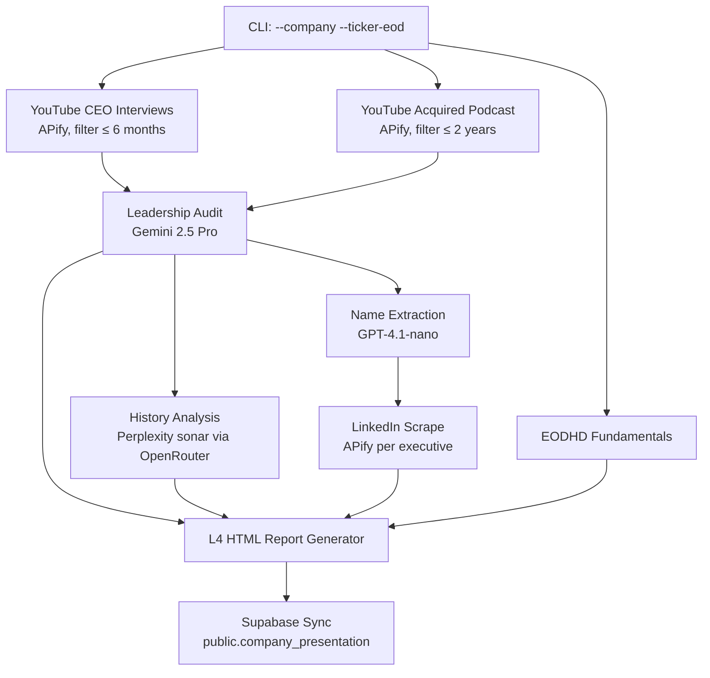

## n8n Workflow → Python Phase Map

| n8n Node | Python Function | Model / Actor |
|---|---|---|
| `Formular (Test)` | CLI argparse (`--company`) | — |
| `Youtube Ceo Interview` + Filter < 6 months | `scrape_youtube_ceo_interview()` | APIFY `streamers~youtube-scraper` |
| `Youtube Aquired Podcast` + Filter < 2 Years | `scrape_youtube_acquired_podcast()` | APIFY `streamers~youtube-scraper` |
| `AI Agent: Leadership und Besitzstrukturen` | `run_leadership_audit()` | Gemini 2.5 Pro |
| `AI Agent: Firmenhistorie und Analyse` | `run_history_analysis()` | Perplexity sonar via OpenRouter |
| `Clean data` | `extract_executive_names()` | GPT-4.1-nano (OpenAI) |
| `Code in JavaScript` (parse names) | built-in JSON parsing | — |
| `LinkedIn Profile Scraper` | `scrape_linkedin_profiles()` | APIFY `apimaestro~linkedin-profile-detail` |
| `L4_Report Generator HTML1` | `generate_l4_html_report()` | Python (HTML template) |
| Supabase (implicit) | `sync_to_supabase()` | `public.company_presentation` |

---

## 1. Required .env Keys

```env
APIFY_API_KEY=...
GOOGLE_GEMINI_API_KEY=...        # for Leadership Audit (Gemini 2.5 Pro)
OPENROUTER_API_KEY=...           # for History Analysis (Perplexity sonar)
OPENAI_API_KEY=...               # for Name Extraction (GPT-4.1-nano)
SUPABASE_URL=...
SUPABASE_SERVICE_ROLE_KEY=...
EODHD_API_KEY=...
```

---

## 2. Usage

```bash
# Research only — saves JSON + HTML to output/
python tools/new-company-presentation.py --company "Danaher"

# With EODHD enrichment + Supabase sync
python tools/new-company-presentation.py \
  --company "Lifco" \
  --ticker-eod LIFCO-B \
  --supabase-sync

# Custom output directory
python tools/new-company-presentation.py \
  --company "Roper Technologies" \
  --ticker-eod ROP.US \
  --supabase-sync \
  --output-dir artifacts/ROP
```

---

## 3. Output Files

| File | Description |
|---|---|
| `output/{Company}_new_presentation.json` | All pipeline results (AI text, YouTube/LinkedIn data, EODHD) |
| `output/{Company}_l4_report.html` | Branded Kasona HTML report (mirrors n8n `L4_Report Generator HTML1`) |

---

## 4. Pipeline Phases (7-step)



---

## 5. Supabase Columns Written

| Column | Source |
|---|---|
| `company_name` | EODHD `General.Name` |
| `description` | EODHD `General.Description` |
| `leadership-governance` | Gemini 2.5 Pro Leadership Audit |
| `history-evolution` | Perplexity sonar History Analysis |
| `ai_agent_firmenhistorie` | Same as `history-evolution` |
| `youtube_ceo_interview` | First CEO interview URL |
| `youtube_podcast` | First Acquired podcast URL |
| `linkedin_profiles` | APIFY LinkedIn results (JSON array) |
| `l4_report` | Full L4 HTML report |
| `n8n-info` | Raw pipeline metadata (JSON) |
| `status` | Set to `to_review` |

---

## 6. Idempotency & ZNCR

- The tool **updates** an existing row (matched by `ticker_eod`) and **inserts** a new one if none exists.
- After syncing, run `remediate_all_pillars.py` to fill any remaining structural pillars (investment_thesis, bull-case, bear-case, etc.) that require additional AI synthesis.
- Zero-Null Compliance Rule: All analytical fields must be ≥ 50 characters before artifact generation.

---

## 7. Example Run

```
$ python tools/new-company-presentation.py --company "Halma" --ticker-eod HLMA --supabase-sync

=================================================================
  Kasona New-Company-Presentation Pipeline: Halma
=================================================================

[1/6] YouTube: CEO Interviews (APIFY, filter < 6 months)...
  [YT] CEO Interview query: 'Ceo Interview Halma'
  [APIFY] Run started (streamers~youtube-scraper): ...
  ... Apify status: RUNNING
  ... Apify status: SUCCEEDED
  [YT] CEO interviews after age filter: 3

[2a/6] Leadership & Governance Audit (Gemini 2.5 Pro)...
  [DONE]

[2b/6] Company History & Analysis (Perplexity sonar via OpenRouter)...
  [DONE]

[3/6] Name Extraction (GPT-4.1-nano)...
  [NAMES] Extracted 4 executive name(s)

[3/6] LinkedIn Profile Scrape (APIFY)...
  [LI] Scraping: Marc Ronchetti Halma
  [LI] 3 LinkedIn profile(s) collected.

[4/6] EODHD Fundamentals (HLMA)...
  [OK] Halma plc

[5/6] Generating L4 HTML Report...
  [DONE]

[SAVED] JSON → output/Halma_new_presentation.json
[SAVED] HTML → output/Halma_l4_report.html

[SYNC] Updating Supabase for ticker: HLMA...
  [SUCCESS] Supabase updated for HLMA.
```
